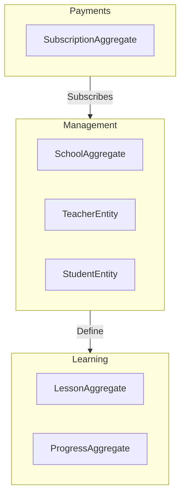

# Context Map do LingoLIVE Enterprise

```mermaid
graph TD
    subgraph Management
    SchoolAggregate
    TeacherEntity
    StudentEntity
    end
    
    subgraph Learning
    LessonAggregate
    ProgressAggregate
    end
    
    subgraph Payments
    SubscriptionAggregate
    end

    Management -- "Define" --> Learning
    Payments -- "Subscribes" --> Management
```
