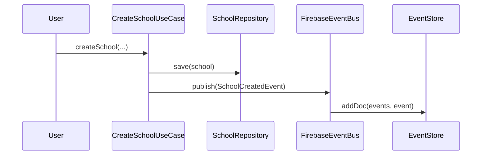

# Event-Driven Architecture (EDA) - LingoLIVE Enterprise

## 1. Design Overview
This document defines the Event-Driven Architecture (EDA) for LingoLIVE IA. It leverages Firestore as the Event Store and Message Bus, ensuring event-based communication across services.

## 2. Event Catalog

| Event Name | Type | Description |
| :--- | :--- | :--- |
| `SchoolCreated` | Domain | A new school entity has been registered. |
| `StudentEnrolled` | Application | A student has been enrolled in a lesson. |
| `SubscriptionPaid` | Integration | A payment for a subscription was confirmed. |

## 3. Sequence Diagrams

### 3.1 Create School (Choreography)

## 4. Architectural Patterns

### 4.1 Message Bus & Event Store
We use Firestore as both the Message Bus (Pub/Sub via collections) and the Event Store (append-only collection).

### 4.2 Idempotency
All events include an `idempotencyKey`. Event consumers must check if the key has been processed before execution.

### 4.3 Saga Pattern & Compensation
For distributed transactions (e.g., Subscription flow):
- If `SubscriptionPaid` fails, the `CompensationTransaction` event is published to reverse any partial state changes.

### 4.4 Dead Letter Queue (DLQ)
Events failing to publish or process are moved to the `dead_letter_queue` collection for manual inspection and retry.

## 5. Retry Policies
- Initial failures trigger a simple retry mechanism in the `FirebaseEventBus`.
- Critical failures move events to DLQ.
